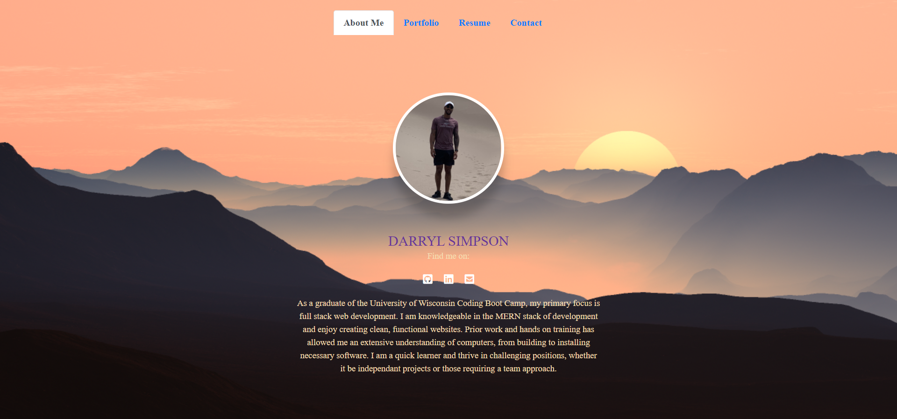

# React Portfolio

  ## Description
    Personal Portfolio using React.js

  <!-- ## Table of Contents

  * [Pcitures](#pictures)
  * [License](#license)
  * [Credits](#credits) -->

  
  ## Pictures

  
  

  [LIVE PORTFOLIO](https://www.google.com/)

      
  ## License
  MIT
   
  [See MIT License](https://choosealicense.com/licenses/mit)

 ## Credits
    
  Contributor: Darryl Simpson  
  GitHub: https://github.com/DarrylSimpson